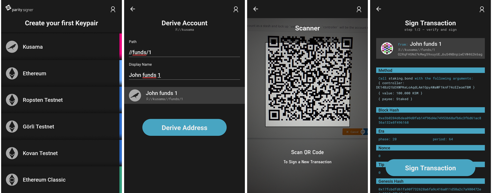

[](https://github.com/paritytech/parity-signer/releases/)
[](https://play.google.com/store/apps/details?id=io.parity.signer)
[](https://itunes.apple.com/us/app/parity-signer/id1218174838)

# Parity Signer - Turn your smartphone into a hardware wallet

Parity Signer is a mobile application that allows any smartphone to act as an air-gapped crypto wallet. This is also known as "cold storage".

You can create Kusama and Ethereum accounts, sign messages/transactions, and transfer funds to and from these accounts without any sort of connectivity enabled on the device.

You must turn off or even physically remove the smartphone's Wifi, Mobile Network, and Bluetooth to ensure that the mobile phone containing these accounts will not be exposed to any online threat.

**Disabling the mobile phone's networking abilities is a requirement for the app to be used as intended.**

Have a look at the tutorial on our wiki to learn how to use [Parity Signer together with Polkadot-js app](https://wiki.parity.io/Parity-Signer-Mobile-App-Apps-Kusama-tutorial) for Kusama,  or [MyCrypto app](https://wiki.parity.io/Parity-Signer-Mobile-App-MyCrypto-tutorial) and [Parity Fether](https://wiki.parity.io/Parity-Signer-Mobile-App-Fether-tutorial) for Ethereum.

Any data transfer from or to the app happens using QR code. By doing so, the most sensitive piece of information, the private keys, will never leave the phone. The Parity Signer mobile app can be used to store any Kusama or Ethereum account, this includes KSM, ETH, ETC as well as Ether from various testnets (Kovan, Ropsten...).

## Device security

Parity Signer was built to be used offline. The mobile device used to run the app will hold valuable information that needs to be kept securely stored. It is therefore advised to:
- Use a dedicated mobile device (not your everyday phone).
- Make a factory reset.
- Enable full-disk encryption on the device, with a reasonable password (might not be on by default, for example for older Android devices).
- Do not use any kind of biometrics such as fingerprint or face recognition for device decryption/unlocking, as those may be less secure than regular passwords.
- Once the app has been installed, enable airplane mode and make sure to switch off Wifi, Bluetooth or any connection ability of the device.
- Only charge the phone on a power outlet that is never connected to the internet. Only charge the phone with the manufacturer's charging adapter. Do not charge the phone on public USB chargers.

## Screenshots



## Build it
### Requirements

- `node.js` ( `>=10`)
- `yarn` (tested on `1.6.0`)
- `rustup` (tested on `rustup 1.16.0`)
- `rustc` (tested on `rustc 1.32.0 (9fda7c223 2019-01-16)`)
- `cargo` (tested on `cargo 1.32.0 (8610973aa 2019-01-02)`)
- `android_ndk` (tested on `r19`)
- `Android Studio` (only for Android, tested on `Version 3.3`)
- `Xcode` (only for iOS, tested on `Version 9.4.1 (9F2000)`)
- `$NDK_HOME` envarionment variable set to ndk home directory (eg. `/usr/local/opt/android-ndk`)
- `$JAVA_HOME` envarionment variable set to java home directory (eg. `/Library/Java/JavaVirtualMachines/jdk1.8.0_60.jdk/Contents/Home`)
- `$ANDROID_HOME` environment variable set to Android SDK directory (eg. `/home/your_username/Android/Sdk`)*.

\* It's recommended to install **Android Studio** and use that to install the necessary build tools and SDKs for the Android version you want to test on. It's also the best way to test in the emulator. **DO NOT INSTALL NDK VIA ANDROID STUDIO** as that will install the latest version. Make sure to get `r19` instead.

### Setup

- macOS

    ```
    ./setup_macos.sh

    echo "ndk.dir=$NDK_HOME" > android/local.properties
    echo "sdk.dir=$ANDROID_HOME" >> android/local.properties
    ```

- linux

    ```
    ./setup_linux.sh

    echo "ndk.dir=$NDK_HOME" > android/local.properties
    echo "sdk.dir=$ANDROID_HOME" >> android/local.properties
    ```

### Usage

- First start React Native server with increased heap to prevent out of memory error

    ```
    yarn start
    ```

Then:
 
- iOS

    ```
    yarn run ios
    ```

- Android

    ```
    yarn run android
    ```


### Test Parity Signer

For a super quick test and to avoid the hurdle of creating an account, sending funds to it and finally create a transaction as described in the [tutorial using Parity Fether](https://wiki.parity.io/Parity-Signer-Mobile-App-Fether-tutorial) or the [tutorial using MyCrypto](https://wiki.parity.io/Parity-Signer-Mobile-App-MyCrypto-tutorial), you can use a pre-funded account on Kovan Network and the following workflow. To get access to this account, you need to:

- Recover an account
- Select `Kovan` network and choose a name
- Use the recovery phrase: `this is sparta` you'll get the account address: `006E27B6A72E1f34C626762F3C4761547Aff1421`
- Validate and accept the warning message
- Chose a pin code
- Scan this QR code to sign a transaction sending some Kovan Eth to the same account.


Corresponding data:

```json
{
    "action": "signTransaction",
    "data": {
        "account": "006e27b6a72e1f34c626762f3c4761547aff1421",
        "rlp": "ea1584ee6b280082520894006e27b6a72e1f34c626762f3c4761547aff1421872386f26fc10000802a8080"
    }
}
```

#### Unit Test

Run `yarn test` for all the units test.

If debugging is needed:

1. Insert `debugger;` in the code where you think it fails.
2. Run `yarn test:debug`
3. Open a new tab in Chrome and go to `chrome://inspect`
4. Click the `inspect` button of target under `Remote Target`
5. Back to the terminal, choose one of the node watch commands to run the tests again.

#### Integration Test

Parity Signer is integrated with [Detox](https://github.com/wix/Detox) E2E testing. Detox has very detailed [documentation](https://github.com/wix/Detox/blob/master/docs/README.md).

First make sure `detox-cli` is installed as global dependency with

```
yarn global add detox-cli
```

##### Complete Test

1. run react native server with `yarn start`

2. run `yarn e2e:ios` or `yarn e2e:android`.

##### Develop and Test
Details please refer to Detox official guide [here](https://github.com/wix/Detox/blob/master/docs/Guide.DevelopingWhileWritingTests.md)

Once you have run `yarn ios` you do not need to build it, just run:
```shell
yarn test-e2e:ios
```
This command will open another simulator with the pre-defined configurations.

Re-run tests without re-installing the app
```
yarn test-e2e:ios --reuse
```

If you want to use another specific emulator/simulator than those defined in the configuration, add `--device-name` flag (on Android API version is needed), for example:
```
yarn test-e2e:ios --device-name iPhone X
yarn test-e2e:android --device-name Pixel_2_API_28
```

On Android please replace `ios` with `android`, currently Detox's Android 0.60.x support is in progress, if there is an error, try to build it again with `yarn build-e2e:android`

### Troubleshooting

#### `No dimension set for key window` on Android < 5.0

This error should be accompanied with `error: closed` in terminal when deploying the debug version of the signer on a device that runs Android older than 5.0. It happens because the Android API does not support the reverse proxy that would allow the phone to communicate with the debug server on your computer.

A suitable workaround is to run both devices on the same WiFi and use your local WiFi IP address. Check your WiFi settings for your local IP address (eg. `192.168.1.42`), then, while having the app open on the phone (either on error page or blank screen) run a command in terminal:

```
adb shell input keyevent 82
```

(You can find `adb` binary in your local Android SDK folder under `platform-tools`, eg. `/home/your_username/Android/Sdk/platform-tools`)

This should open a menu on the device. In that menu go to `Dev Settings` > `Debug server host & port for device`, and enter your local IP address with port 8081 (eg. `192.168.1.42:8081`). Restart the app, the error should disappear.

#### Upgrading NDK from `r13b` to `r19`

1. [Download NDK `r19`](https://developer.android.com/ndk/downloads/), unpack it in a convenient location.
1. Update your `NDK_HOME` env variable to the absolute path of the NDK directory.
1. Edit `./android/local.properties` so that `ndk.dir` points to the absolute path to the NDK directory.
1. Remove old NDK build with `rm -rf ./NDK`.
1. Build the new NDK with `./create-ndk-standalone.sh`.
