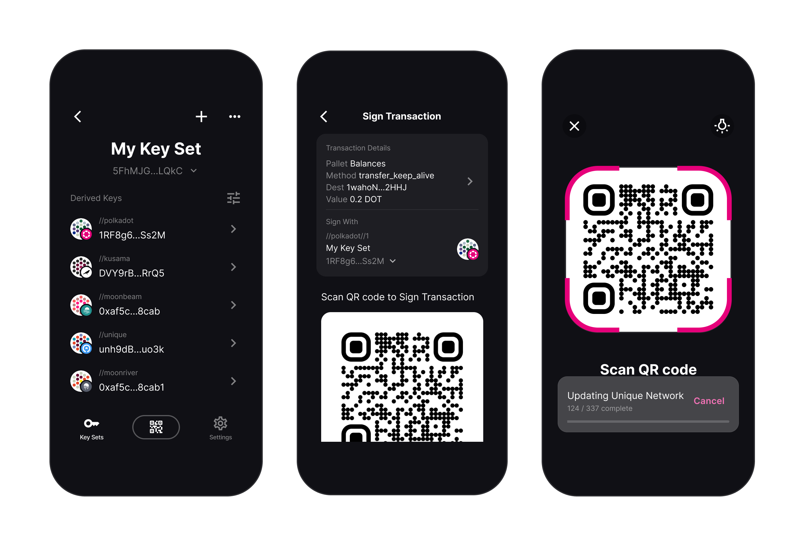

<div align="center">


</div>

<div align="center">
    <br><br>
    Air-gapped cold storage for your crypto keys
    <br><br>
</div>

<div align="center">
    <a href="https://github.com/paritytech/parity-signer/releases"></a> <a href="https://play.google.com/store/apps/details?id=io.parity.signer"></a> <a href="https://itunes.apple.com/us/app/parity-signer/id1218174838"></a><br><br>
</div>

# Introduction

Polkadot Vault is a mobile application that allows any smartphone to act as an air-gapped crypto wallet. This is also known as "cold storage".

You can create accounts in Substrate-based networks, sign messages/transactions, and transfer funds to and from these accounts without any sort of connectivity enabled on the device.

You must turn off or even physically remove the smartphone's Wifi, Mobile Network, and Bluetooth to ensure that the mobile phone containing these accounts will not be exposed to any online threat. Switching to airplane mode suffices in many cases.

☝️ **Disabling the mobile phone's networking abilities is a requirement for the app to be used as intended, check our [wiki](https://paritytech.github.io/parity-signer/about/Security-And-Privacy.html) for more details.**

Any data transfer from or to the app happens using QR code. By doing so, the most sensitive piece of information, the private keys, will never leave the phone. The Polkadot Vault mobile app can be used to store any Substrate account, this includes Polkadot (DOT) and Kusama (KSM) networks.

**Available for both iOS and Android.**



# Links

- [Official Website](https://signer.parity.io/)
- [Docs](https://paritytech.github.io/parity-signer/index.html) — auto-generated documentation for end users
- [App Store](https://itunes.apple.com/us/app/parity-signer/id1218174838), [Google Play](https://play.google.com/store/apps/details?id=io.parity.signer), [Github Releases](https://github.com/paritytech/parity-signer/releases) — public builds
- [Signer Companion](https://parity.link/signer-companion) — web extension to inject keys from Signer and sign transactions through the browser
- [Metadata Portal](https://metadata.parity.io) — QR codes with the latest metadata
- [BananaSplit](https://bs.parity.io) — split your seed phrase for maximum security
- [Legacy: last public release with React Native](https://github.com/paritytech/parity-signer/tree/legacy-4.5.3)

# Features

- Generate and store multiple private keys
- Parse and sign transactions
- Use derived keys to have multiple addresses with a single seed phrase
- Backup and restore your accounts
- View activity log to detect unauthorized access
- Update [metadata](https://metadata.parity.io) without going online
- Add new networks

# How to use

Please read our documentation before using Vault for the first time or before upgrading. It covers the main use-cases such as installing on a new phone, creating keys, upgrading and adding new networks:

👉 https://paritytech.github.io/parity-signer/index.html

To contribute into the documentation use [docs](docs) folder

# Project Structure

Vault is a native app for iOS and Android. Native UI's are written on Swift and Kotlin and built on top of a universal Rust core library, which implements all the logic. Here's a rough folder structure of the project.

- `android` - Android project. Builds by Android Studio automatically
- `docker` - files for CI on gitlab
- `docs` - official documentation. Built and published on each commit
- `ios` - iOS project folder. Read how to build it in the "Build Process" section
- `rust` - backend Rust code. Internals are listed below
- `scripts` - mostly releasing scripts and `./build.sh` required for building iOS library

Since most of the application logic is concentrated in the `rust` folder, it makes sense to review it separately.

There are 3 actual endpoints in `rust` folder: `signer`, which is source of library used for Vault itself; `generate_message`, which is used to update Vault repo with new built-in network information and to generate over-the-airgap updates; and `qr_reader_pc` which is a minimalistic app to parse qr codes that we had to write since there was no reasonably working alternative.

Sub-folders of the `rust` folder:

- `constants` — constant values defined for the whole workspace.
- 🔥 `db_handling` — all database-related operations for Vault and `generate_message` tool. Most of the business logic is contained here.
- `defaults` — built-in and test data for database
- `definitions` — objects used across the workspace are defined here
- `files` — contains test files and is used for build and update generation processes. Most contents are gitignored.
- `generate_message` — tool to generate over-the-airgap updates and maintain network info database on hot side
- 🔥 `navigator` — navigation for Vault app; it is realized in rust to unify app behavior across the platforms
- `parser` - parses signable transactions. This is internal logic for `transaction_parsing` that is used when signable transaction is identified, but it could be used as a standalone lib for the same purpose.
- `printing_balance` — small lib to render tokens with proper units
- `qr_reader_pc` — small standalone PC app to parse QR codes in Vault ecosystem. Also is capable of parsing multiframe payloads (theoretically, in practice it is not feasible due to PC webcam low performance)
- `qr_reader_phone` — logic to parse QR payloads in Vault
- `qrcode_rtx` — multiframe erasure-encoded payload generator for signer update QR animation.
- `qrcode_static` — generation of static qr codes used all over the workspace
- 🔥 `signer` — FFI interface crate to generate bindings that bridge native code and rust backend
- `transaction_parsing` — high-level parser for all QR payloads sent into Vault
- `transaction_signing` — all operations that could be performed when user accepts payload parsed with transaction_parsing

> 🔥 — this emoji means an important folder for the application logic

# Build Process

**1.** First and foremost, make sure you have the latest [Rust](https://www.rust-lang.org/tools/install) installed in your system. Nothing will work without Rust.

If you get errors like `cargo: feature X is required`, it most likely means you have an old version of Rust. Update it by running `rustup update stable`.

**2.** Install `uniffi-bindgen`. Version has to match the version of `uniffi` crates specified
   in the project (currently it is `0.22.0`):

   ```bash
   cargo install uniffi_bindgen --version 0.22.0
   ```

**3.**  Ensure [opencv crate dependencies](https://crates.io/crates/opencv).

## iOS

**4.** You probably already have [Xcode](https://developer.apple.com/xcode/) installed if you are reading this. If not, go get it.

**5.** Install dependencies
Currently most of iOS tooling is integrated via [Homebrew](https://brew.sh) to avoid use of [CocoaPods](https://cocoapods.org).

Before running project for the first time, run the following in the console

```bash
brew install swiftgen
brew install swiftformat
brew install swiftlint
```

If you are using M1 machine, it might be necessary to run following commands for XCode's Build Phases to run tooling correctly:
```
sudo ln -s /opt/homebrew/bin/swiftgen /usr/local/bin/swiftgen
sudo ln -s /opt/homebrew/bin/swiftformat /usr/local/bin/swiftformat
sudo ln -s /opt/homebrew/bin/swiftlint /usr/local/bin/swiftlint
```

**6.** Open the `PolkadotVault.xcodeproj` project from the `ios` folder in your Xcode. Project features three schemes:
- `PolkadotVault` - used for deployments and running production-ready app on your devices
- `PolkadotVault-Dev` - development scheme that can be used to simulate offline mode without turning off WiFi on your Mac if you are using simulator.
- `PolkadotVault-QA` - scheme that is used for TestFlight distribution of QA builds

To run project, select one of the schemes and click `Run` (Cmd+R)

**Note:** If you are using `PolkadotVault` scheme, the first time you start the app, you will need to put your device into Airplane Mode. In the iOS simulator, you can do this by turning off WiFi on your Mac, hence use of `PolkadotVault-Dev` is recommended for both simulator and device development.

However, we strongly recommend that you use a real device for development, as some important parts (e.g. camera) may not work in the simulator.

## Android

**4.** Install necessary rust targets (this set may vary depending on the target device architecture
   you are building for):

   ```bash
    rustup target add aarch64-linux-android armv7-linux-androideabi x86_64-linux-android
   ```
Note - old x86 is not supported. Just use x86_64 emulator image.

**5.** Download [Android Studio](https://developer.android.com/studio).

**6.** Open the project from the root directory.

**7.** Install NDK. Currently specific version 24.0.8215888 is required.

Android Studio -> SDK Manager -> SDK Tools tab. Find NDK there.
Enable "Show package details" checkmark to select specific version.

**8.** Connect your device or create a virtual one. Open `Tools -> Device Manager` and create a new phone simulator with the latest Android.

**9. (macOS)** : Specify path to `python` in `local.properties`.

`rust.pythonCommand=python3`

**10.** Run the project (`Ctrl+R`). It should build the Rust core library automatically.

# Release Android

- Create PR with new app version updated and tag v* (example "v6.1.3")
- After merging to master - run release-android.yml flow. It will build and sign apk and upload it to internal track in play store
- Create github release with apk from release flow
- Go to play store, promote internal track to production and update changes in play store

# Tests

Core Rust code is fully covered by tests, and they run in CI on each commit. To run tests on your machine:

```
cd rust && cargo test --locked
```

We don't have test for UIs for now (other than navigation which is handled on rust side), which means Swift and Kotlin are not covered. We plan to do it in the future.


# Bugs and Feedback

If you found a bug or want to propose an improvement, please open [an issue](https://github.com/paritytech/parity-signer/issues).

Try to create bug reports that are:

- _Reproducible._ Include steps to reproduce the problem.
- _Specific._ Include as much detail as possible: which version, what phone, OS, etc.
- _Unique._ Do not duplicate existing opened issues.
- _Scoped to a Single Bug._ One bug per report.

Official team email for direct inquiries: signer@parity.io

# Contributing

Our contribution guidelines are still in development. Until then, you're welcome to participate in discussions and send PRs with small bugfixes, we'd love it. Each PR must be reviewed by at least two project maintainers.

# License

Polkadot-Vault is [GPL 3.0 licensed](LICENSE).
