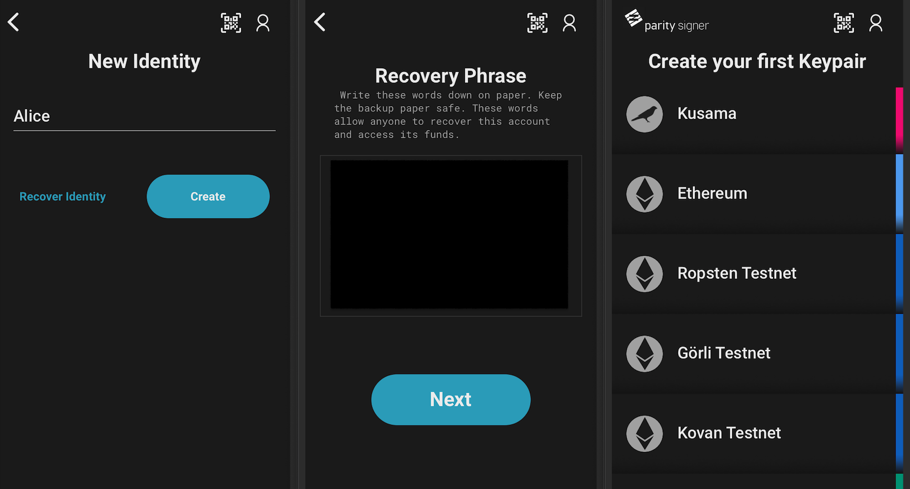
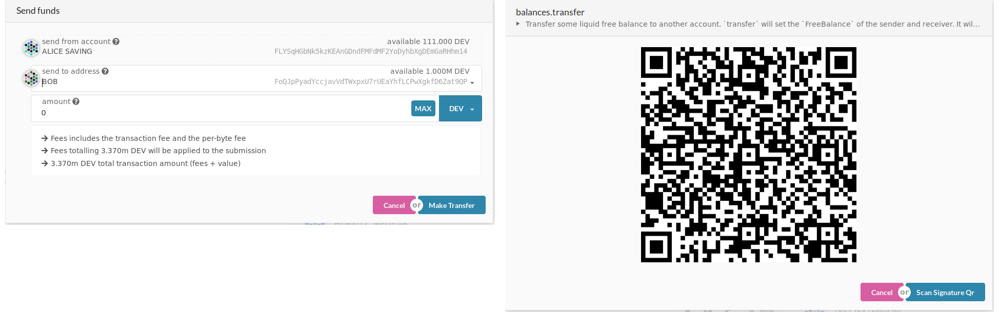
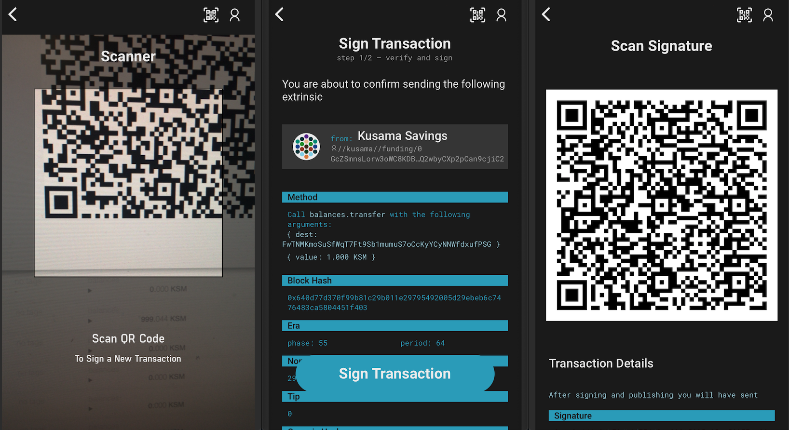

# Polkadot Vault tutorial with Polkadot-js apps

This tutorial will walk you through setting up a Kusama account with the Polkadot Vault Android or iOS App and then use this account together with [Polkadot-js apps](https://polkadot.js.org/apps/) to see your balance and transfer funds or perform any extrinsic from this account.

* Notice: The UI maybe variant for different versions, but the functionalities are the same in `v4` version.

## Summary

- [1. Get Polkadot Vault mobile application](#1-get-parity-signer-mobile-application)
- [2. Setup or recover an identity](#2-setup-or-recover-an-account)
  - [Create an identity](#create-an-account)
  - [Recover an identity with your recovery phrase](#recover-an-account-with-your-recovery-phrase)
- [3. Add Polkadot Vault's account to Polkadot-js apps](#3-add-parity-signers-account-to-polkadot-js-apps)
- [4. Sign a transaction](#4-sign-a-transaction)

## 1. Get Polkadot Vault mobile application

### Device security

Polkadot Vault is meant to be used offline. The mobile device used to run Polkadot Vault will hold valuable information that needs to be kept securely stored. It is therefore advised to:

- Get a Polkadot Vault dedicated mobile device.
- Make a factory reset.
- Enable full-disk encryption on the device, with a reasonable password (might not be on by default, for example for older Android devices).
- Do not use any biometrics such as fingerprint or face recognition for device decryption/unlocking, as those may be less secure than regular passwords.
- Once Polkadot Vault has been installed, enable airplane mode and make sure to switch off Wifi, Bluetooth or any connection ability of the device.
- Only charge the phone using a power outlet that is never connected to the internet. Only charge the phone with the manufacturer's charging adapter. Do not charge the phone on public USB chargers.

Please find more info [here](#Polkadot-Vault-Mobile-App) about the Polkadot Vault application.

### Install Polkadot Vault mobile application

Install Polkadot Vault making sure that it originated from **Parity Technologies**

- [Android](https://play.google.com/store/apps/details?id=io.parity.signer)
- [iOS](https://itunes.apple.com/us/app/parity-signer/id1218174838)

## 2. Setup or recover an Identity

When launching the app for the first time, no identity has been set up yet. At this stage, you will either want to create an identity directly from your mobile device or recover an identity previously created.

### Create an identity

Tap on the `Create` button, and give a name to this identity.

In the next step, your recovery phrase will be presented to you. Think of it as a master key. If you lose it, you lose your money.
**Write this recovery phrase down and store it in a safe place**.
If your phone gets stolen/broken/forgotten this will be the only way to [recover your account](#recover-an-account-with-your-recovery-phrase).

You will then be asked to choose a pin code. This pin will be needed later on to unlock your account to manage the identity or sign a transaction.

The next screen will allow you to select a network to generate an account.
If you choose an Ethereum network, the related Ethereum account will be generated for the identity,

If you choose a Substrate network (like Kusama), you will first create a root account, and then you will be able to derive more accounts with specified paths and names. The name can be changed later on, but once the path is set, it can not be changed. More information about path derivation see [here](#Polkadot-Vault-Hierarchical-Deterministic-Key-Derivation).

For each derived account, you will be able to see the address and its related QR code.

### Recover an identity with your recovery phrase

If you already have an account created with either Polkadot Vault or any other wallet, you can recover it by doing so:

- Tap on the top right side user icon, and choose ` + Add Identity`.
- Input the new identity name and tap the `Recover Identity` button.
- Type in the recovery phrase, word suggestion helps you prevent any typo. The field will turn red if the recovery phrase is not a `bip39`.
- Tap `Recover Identity`.
- Select a PIN number and confirm it by typing it again.
- Identity generated, now you can select the network to create the first account.

NOTICE: For `V3` user, after recovering the seed phrase of Kusama account, the account will appear as an identity root account aside with identity name in the network selection screen.

## 3. Add Polkadot Vault's account to Polkadot-js apps

To be able to follow this tutorial and interact with the Blockchain from a freshly created account on Polkadot Vault, you will need to get some KSMs on this account first. Polkadot-js apps allows you to manage your Vault account seamlessly.

- Visit [Polkadot-js apps](https://polkadot.js.org/apps/) website.
- Go to `Accounts` from the left sidebar.
- Click on `Add via QR` button in the top right-hand corner.
- It will ask for the webcam permission for you to scan the Polkadot Vault's account QR code, accept it.
- On Polkadot Vault, choose on the account you want to copy the address of.
- Scan the QR code displayed on your phone with your computer's webcam. Make sure the QR code is fully displayed on your mobile's screen.
- You can now name this account on Polkadot-js apps.

### 4. Sign a transaction

Assuming that your Polkadot Vault account now has funds, you will be able to send some funds securely to anyone, without transferring your private key, and without needing any internet connection on your mobile phone.

- On Polkadot-js apps, click on the `send` button next to your account.
- On Polkadot-js apps, enter the address of the account you want to send funds to. Make sure to try with a small amount of money first before sending larger amounts.
- Click on `Make Transfer`
- Review the transaction, you can add tip to this transaction.
- Click on `Scan via QR Code` when you're done.

You will now be presented with a QR code that represents the transaction. Since this transaction is sending funds from your Polkadot Vault mobile app account, only this account (sitting on your phone) can sign and authorize this transaction. This is what we'll do in the next steps:

- From the Polkadot Vault account overview, tap the scan button on the top right and scan the QR code presented by the Polkadot-js apps website.
- Review the transaction addresses and the amount to send on your phone. The amount and addresses must match what you've entered in apps. If you got phished, this is where you can realize it and reject the transaction.
- Once you're sure, scroll down and click `Sign Transaction` to enter your pin and get the QR code of the scanned transaction.

Your phone has now *signed the transaction offline* using your Polkadot Vault account private key. The QR code that is now displayed on your phone represents a signed transaction that can be broadcasted. We will do this in the next steps:

- On Polkadot-js apps, click on `Scan Signature QR`, this will ask to turn on your webcam again.
- Face your phone's display to your webcam for the website to be able to read the signed transaction.
- Your transaction is sent automatically.
- Congrats you just sent funds from an air-gapped account :)
