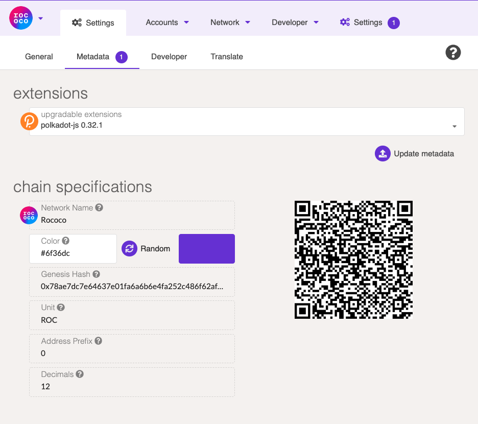

# Update Network Tutorial

Parity Signer support adding a new Substrate based network or update the existing network via QR code.

## Importing network from polkadot.js

This tutorial will walk through how to add a new Rococo Network with Polkadot.js App.

**This is a work in progress, things could change**

### 1. Get the network metadata as QR Code

Switch to the network you want to play with on Polkadot.js app. Click `Settings` -> `MetaData`

Here we can see the chain specifications like `Network Name`, `Address Prefix`, and `Genesis Hash` etc. They are all the metaData of the network which is required by Parity Signer. The only item we could change is network color, it is used on Parity Signer to distinguish other networks.

On the right side is the QR Code we need.

### 2. Scan metadata QR code with Parity Signer

Now on the Parity Signer app, click the QR scanner Button, and scan this QR code stream. Please check the hash and note the signig key - now all updates for this network and this particular Signer devise should be signed with the same key.

If the preview information is legit, click "Accept" (otherwise cancel transaction). Now you will have the new Network added to Parity Signer. You can now create accounts under it and sign extrinsic with this network.

Please note that as network develops, its metadata will change over time. New metadata should be downloaded in similar manner when new version is available before any transactions could be signed.

## Generate network updating QR stream

This is an advanced operation that should only be performed by experienced users on trusted machine. Remember, that any inaccuracy in network specifications or metadata may lead to serious security threat, loss of funds and/or general account access!

Please follow readme in `rust/generate_message` crate
