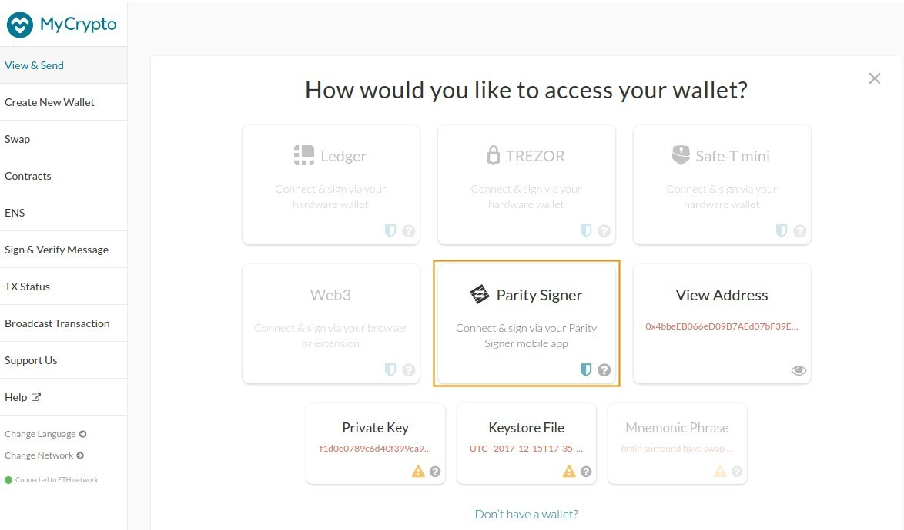
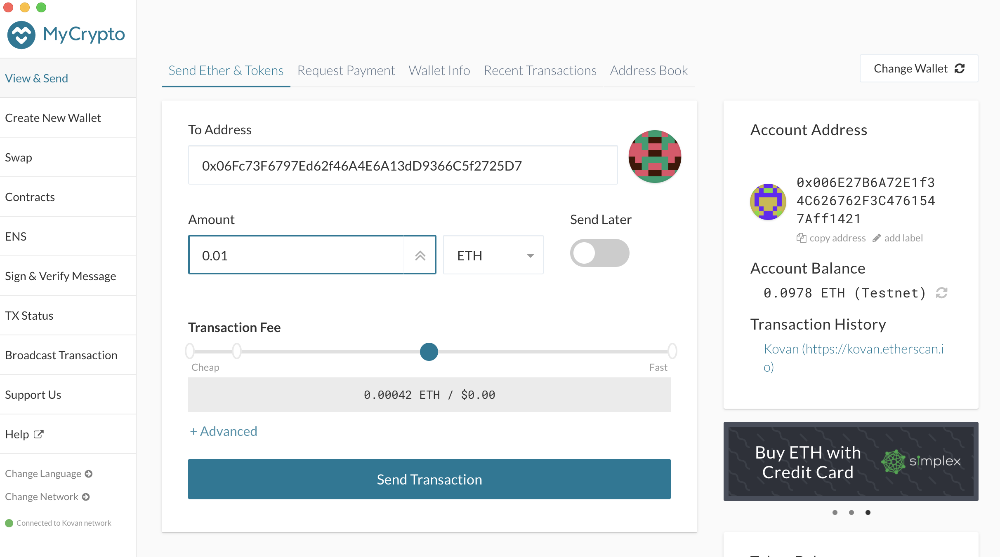

# Stylo tutorial with MyCrypto

This tutorial will walk through setting up an account with Stylo Android or iOs App and sign a transaction using [MyCrypto Desktop App](https://download.mycrypto.com/) to transfer Ether from one account to another.

* Notice: The UI maybe variant for different versions, but the functionalities are the same in v4 version.

## Summary
- [1. Get Stylo mobile application](#1-get-parity-signer-mobile-application)
- [2. Setup or recover an account](#2-setup-or-recover-an-account)
  - [Create an account](#create-an-account)
  - [Recover an account with your recovery phrase](#recover-an-account-with-your-recovery-phrase)
- [3. Copy Stylo account's address](#3-copy-parity-signer-accounts-address)
- [4. Sign a transaction on MyCrypto](#4-sign-a-transaction-using-mycrypto-desktop-app)

## 1. Get Stylo mobile application

### Device security
Stylo is meant to be used offline. The mobile device used to run Stylo will hold valuable information that needs to be kept securely stored. It is therefore advised to:
- Get a separate mobile device.
- Make a factory reset.
- Enable full-disk encryption on the device, with a reasonable password (might not be on by default, for example for older Android devices).
- Do not use any biometrics such as fingerprint or face recognition for device decryption/unlocking, as those may be less secure than regular passwords.
- Once Stylo has been installed, enable airplane mode and make sure to switch off Wifi, Bluetooth or any connection ability of the device.
- Only charge the phone using a power outlet that is never connected to the internet. Only charge the phone with the manufacturer's charging adapter. Do not charge the phone on public USB chargers.

Please find [here](Parity-Signer-Mobile-App) more info about the Stylo application.

### Install Stylo mobile application

Install Stylo making sure that it originated from **Parity Technologies**
- [Android](https://play.google.com/store/apps/details?id=com.stylo-app)
- [iOs](https://itunes.apple.com/us/app/parity-signer/id1218174838)

## 2. Setup or recover an account
When launching the app for the first time, no account has been set up yet. At this stage, you will either want to create an account directly from your mobile device or recover an account previously created with Stylo or [Parity UI / Wallet](https://wiki.parity.io/Parity-Wallet) (Desktop)
 
### Create an account
 
Tap on the `Create` button after Stylo's first launch, you can then name your identity.

In the next step, your recovery phrase will be presented to you. Think of it as a master key. If you lose it, you lose your money.
**Write this recovery phrase down and store it in a safe place**.
If your phone gets stolen/broken/forgotten this will be the only way to [recover your account](#recover-an-account-with-your-recovery-phrase).

You will then be asked to choose a pin code. This pin will be needed later on to unlock your account to manage the identity or sign a transaction.

The next screen you will allow you to select a network for generating an account.

### Recover an account with your recovery phrase

If you already have an account created with either Stylo or any other wallet, you can recover it by doing so:
- Tap on the top right side user icon, and choose ` + Add Identity`.
- Input the new identity name and tap the `Recover Identity` button.
- Type in the recovery phrase, word suggestion helps you prevent any typo. The field will turn red if the recovery phrase is not a bip39.
- Tap `Recover Identity`.
- Select a PIN number and confirm it by typing it again.
- Once your Identity is generated, you can select a network to create your first account.

## 3. Copy Stylo account's address

To be able to follow this tutorial and send Ether from a freshly created account on Stylo mobile app, you will need to get some Ether on this account first. A convenient way to copy the address of a new Stylo account is to use the `View & Send` option of MyCrypto Desktop App. Download, install and launch [MyCrypto Desktop App](https://download.mycrypto.com/).

- On MyCrypto App, click on Stylo.
- On Stylo account list, select the account you want to copy the address .
- Scan the QR code displayed on your phone with your computer's webcam. Make sure the QR code is fully displayed on your mobile's screen.
- You can now copy the address of your account in MyCrypto and send Ether to it from another account using your favourite Wallet application.

### 4. Sign a transaction using MyCrypto Desktop App

Assuming that your Stylo account now has funds, you will be able to send some Ether securely to anyone, without transferring your private key, and without needing any internet connection on your mobile phone.

- To do so, click on `Stylo` from MyCrypto Desktop app.

- On your phone, select in the account list the account you want to send funds from of and tap `Show account QR code`.
- Scan the QR code displayed on your phone with your computer's webcam. Make sure the QR code is fully displayed on your mobile's screen.
- MyCrypto will now allow you to enter the address of the account you want to send Ether to as well as the amount of gas. Make sure to try with a small amount of Ether first before sending larger amounts.
- Click on `Send transaction` when you're done.

You will now be presented with a QR code that represents the transaction. Since this transaction is sending funds from your Stylo mobile app account, only this account (sitting on your phone) can sign and authorise this transaction. This is what we'll do in the next steps:
- From the Stylo mobile app, tap the scan button on the top right and scan the QR code presented by MyCrypto Desktop app.
- Review the transaction addresses and the amount to send on your phone. The amount and addresses must match what you've entered in MyCrypto. If you got phished, this is where you can realise it and reject the transaction.
- Once you're sure, scroll down and click `Sign Transaction` to enter your pin.

Your phone has now *signed the transaction offline* using your Stylo account private key. The QR code that is now displayed on your phone represents a signed transaction that can be broadcasted. We will do this in the next steps:
- On MyCrypto Desktop, click on `Scan`.
- Face your phone's display to your webcam for MyCrypto to be able to read the signed transaction.
- Verify one last time that the account addresses are correct as well as the amount to transfer on MyCrypto.
- Click `Send` on MyCrypto.
- Congrats you just sent Ether from an air-gapped account :)

